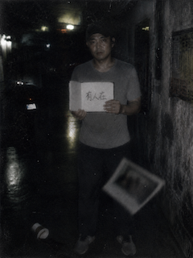

# 案件报告

**案件名称**：刑警孟凡被害案

**案件编号**：YC-02-0120

**勘查时间**：2024-03-09

**勘查地点**：南城区夜色酒吧后巷

**勘查人员**：周正

**天气情况**：阴，气温较低

---

## 被害人信息

**姓名**：孟凡

**性别**：男

**年龄**：39岁

**职业**：刑警

---

## 一、现场概况

现场位于某酒吧侧门外约二十米处的狭窄巷道内。邻近编号`YC-01-0118`发生地。巷道两侧为商业建筑后墙及封闭围栏，仅巷口设有路灯，案发位置光线昏暗。

死者倒卧于巷道前段，周围仅有死者本人的鞋印，现场未发现明显打斗痕迹，随身财物完好，手机及钱包均在尸体附近。

巷口及酒吧后门安装有监控设备。经调取发现，案发时段前后约十分钟内，多处监控同时出现雪花、信号扭曲及短暂中断。画面恢复后，死者已经倒地，无法记录倒地过程及是否有他人在场。

---

## 二、尸体位置与状态

尸体位于巷道中央偏北位置，呈半跪姿态，上身向前倾倒。右手伸向前方，左手压于胸口。瞳孔散大，面色苍白。

现场未发现明显出血。初步推定死亡时间为01:00至02:00。

---

## 三、物证提取

* 死者随身手机一部，屏幕无破损，已封存送检。
* 死者随身笔记本，录连续猝死案件调查笔记，提及监控异常、死亡时间重合及电子设备干扰等。
* 死者血液、胃内容物及心脏组织样本，已送法医检验。
* 死者手机通话记录已进行电子取证。
* `死者社交账号内发现一张异常照片，发布时间约为被害时间，内容为被害人举着写着“有人在”的写字板`，已进行电子取证。

## 四、痕迹情况

法医现场勘验显示死者无明显机械性损伤、无窒息痕迹、无中毒表现，心脏出现异常骤停表现。具体死因需等待尸检结果。

现场不存在第三方暴力侵害证据。但死者作为案件主办刑警，在执行蹲守任务过程中突然死亡，具高度异常性。结合此前连续异常猝死案件，初步认定本案与系列案件存在关联。

重点异常情况：

* 监控再次出现雪花干扰，与前三起案件一致。
* 死者手机内最后照片显示“有人在”，推测为生命最后阶段试图传递调查信息。
* 死者生前执行蹲守任务，观察凶手是否重返案发区域，存在遭遇案件相关人员可能性。

---

## 五、初步结论与建议侦查方向

### 初步结论

本案基本确定他杀可能。死因与连续猝死案件高度一致，死者身份特殊，案件危险程度已升级，正式并入“连续异常死亡事件”。

---

## 六、走访调查情况

### 姓名：李静

**与死者关系**：妻子
**询问内容**：
孟凡近两周持续加班，经常提及手上案件古怪。除此之外无异常

**补充说明**：
死者近期睡眠差，但身体健康，无心脏疾病病史。

### 姓名：酒吧保安

**与死者关系**：现场目击者
**询问内容**：
23:00左右见孟凡独自在附近活动，本来以为是顾客结果发现只在外面站了一会儿，随后回车上。后面00:00保安换班，换班之后的保安未见孟凡

### 七. 附录

